# Vangreat User Documentation

## Table of Contents
- [Vangreat User Documentation](#vangreat-user-documentation)
  - [Table of Contents](#table-of-contents)
  - [Introduction](#introduction)
  - [Getting Started](#getting-started)
  - [Creating an Account](#creating-an-account)
  - [Posting an Item](#posting-an-item)
- [Shop](#shop)
  - [Add shop](#add-shop)
  - [Navigate to a shop](#navigate-to-a-shop)
  - [Shop Reputation and Reviews](#shop-reputation-and-reviews)
- [Post](#post)
    - [Like a post](#like-a-post)
    - [Add comment](#add-comment)
    - [Edit Post](#edit-post)

## Introduction
Welcome to Vangreat, a centralized platform for buying and selling second-hand items. This documentation will guide you through the process of using Vangreat to buy and sell items safely and conveniently.

## Getting Started
To get started with Vangreat, you'll need have 

- the internet and 
- a web browser. 

Simply navigate to the Vangreat website to get started.

## Creating an Account

First you navigate to sign in page. You can go here by either clicking "Log in" button on top navigation bat, or visit `vsngreat.com/login` on browser

then, click **register your account**

Now you are register page, and you can set your email, username, and password.

after successful registraation, you will be automatically brought to home page.

## Posting an Item

Click **New Post**. 

Fill out the required information, including the item name, description, price, and images, and etc.

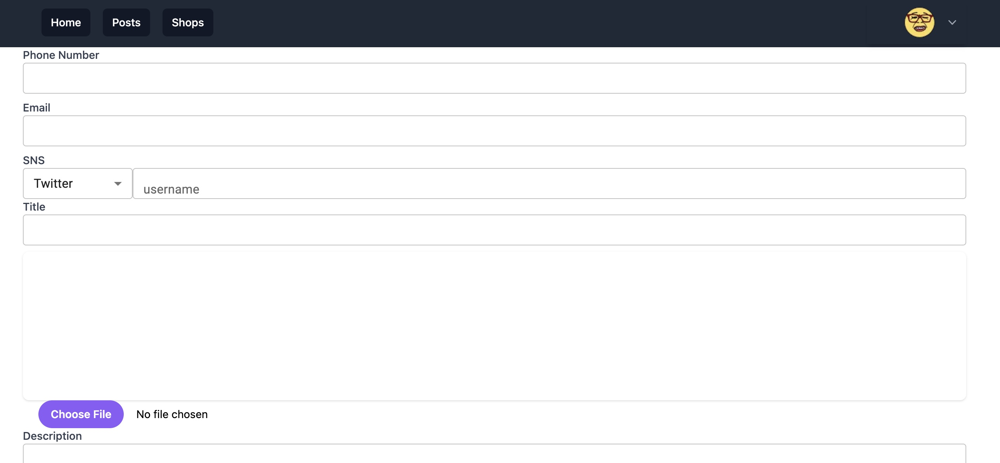

click **Submit** to publish your item to the marketplace.

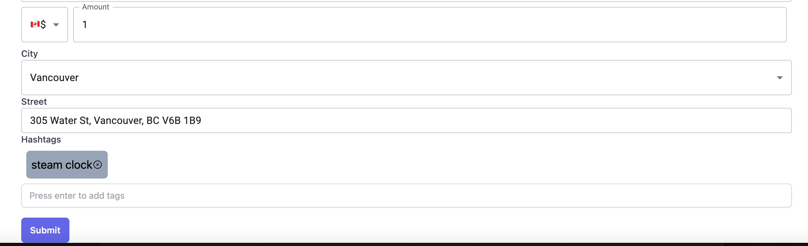

You will be navigated to home page automatically.

# Shop

## Add shop

Click **Create**

Fill required fields

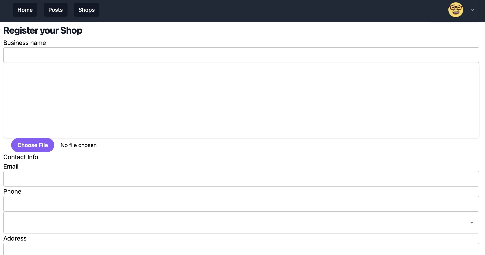

After fill everything, click **Submit**
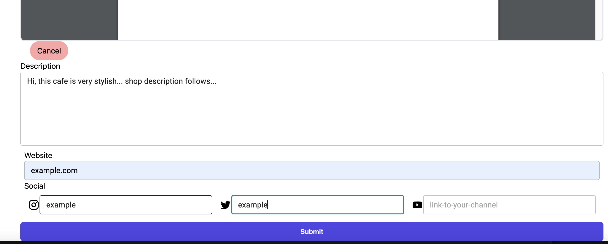

## Navigate to a shop

Click **Shop**

Click any shop you are interested
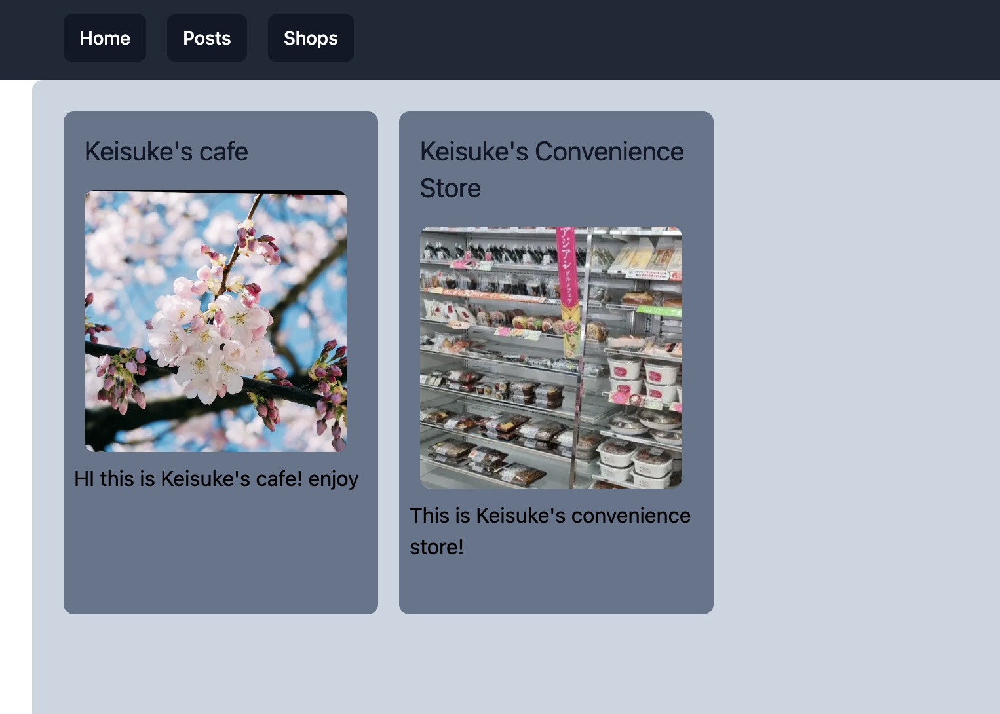

There!
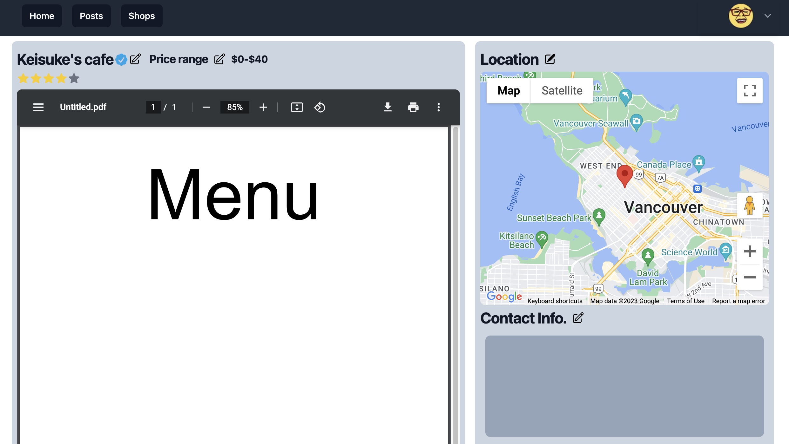

## Shop Reputation and Reviews
Go to Shop page.

Scroll down and you will find **Review** section.

Once you find, ckick **Write review**

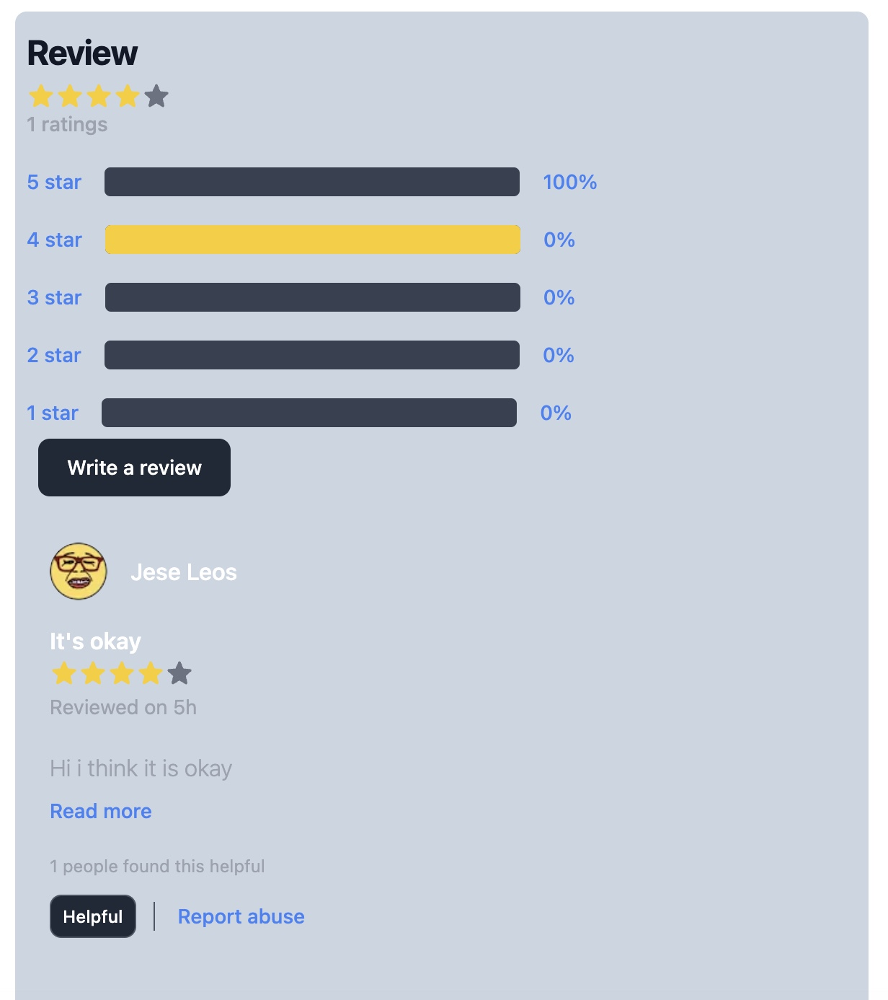

Write review here.

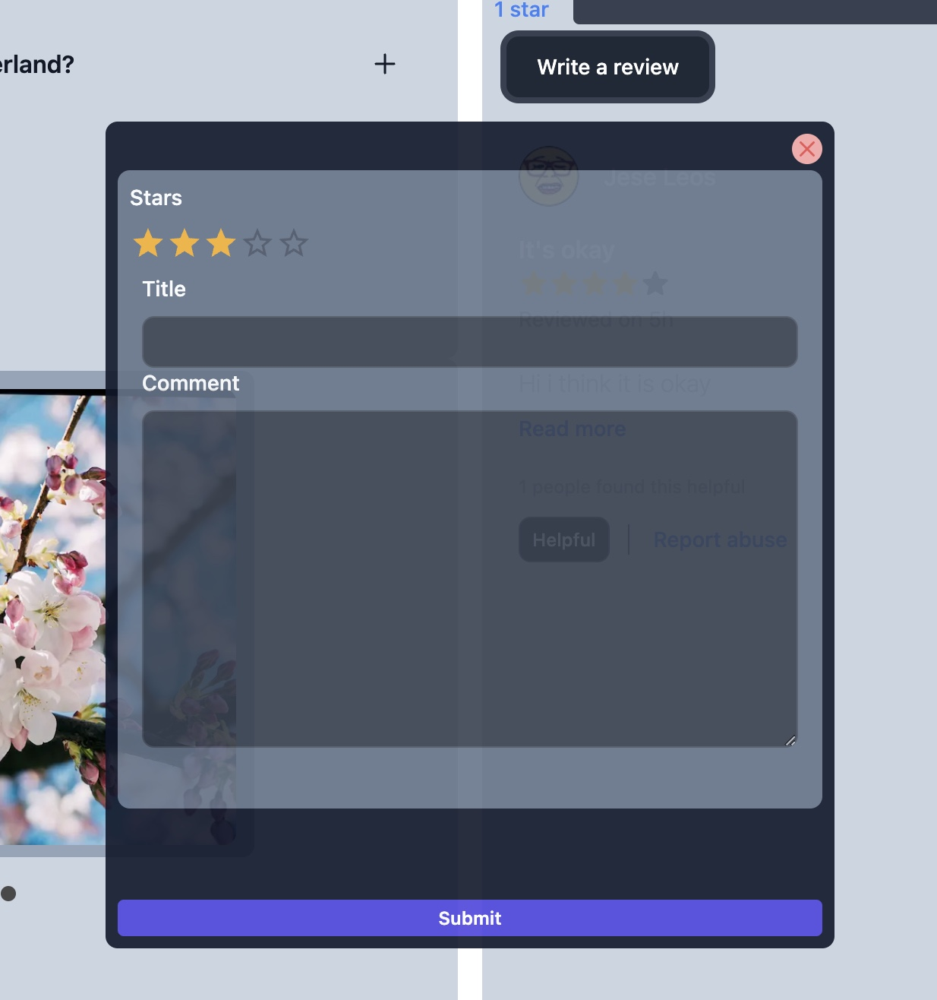

# Post

### Like a post
Simple, you can just click heart button to like!
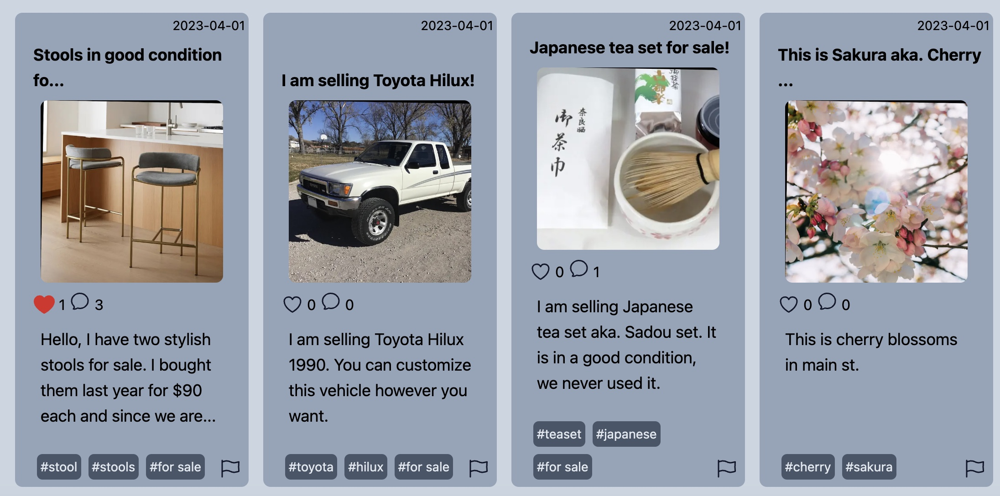

### Add comment

Simply type anything and click paper plane button
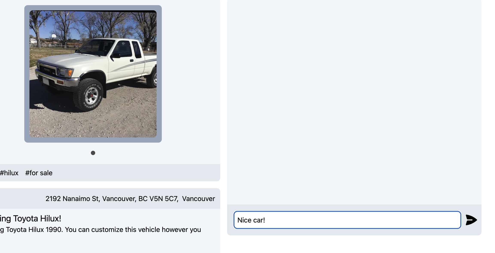

There!

### Edit Post

By clicking Edit button, you can also edit the opst as original poster. However, this is a coming feature... please be ready for the change... 😊
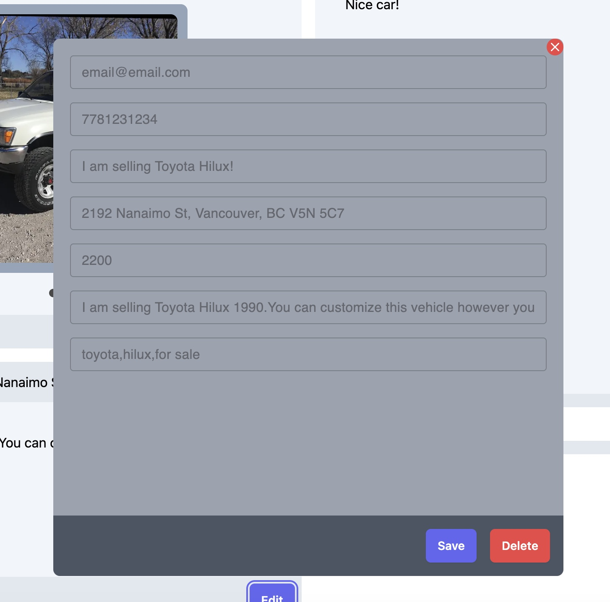
