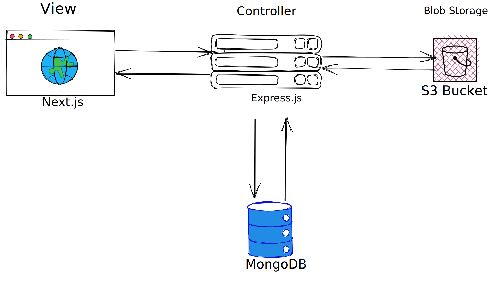

# Technical Doc.

- [Technical Doc.](#technical-doc)
- [WHAT are we solving?](#what-are-we-solving)
  - [Problem Overview](#problem-overview)
  - [Assumptions](#assumptions)
  - [Current Version](#current-version)
  - [Future Versions](#future-versions)
- [WHY is this project created?](#why-is-this-project-created)
  - [Impact the project will have](#impact-the-project-will-have)
  - [Target audience](#target-audience)
- [WHO uses the product and needs to be involved?](#who-uses-the-product-and-needs-to-be-involved)
  - [Primary users](#primary-users)
  - [Dependencies](#dependencies)
    - [NextAuth](#nextauth)
    - [AWS s3](#aws-s3)
- [HOW it works?](#how-it-works)
  - [Features](#features)
  - [Wireframes](#wireframes)
  - [Known Issues](#known-issues)
- [Motivation](#motivation)
- [Requirements](#requirements)
- [Design Choices](#design-choices)
  - [NextJS frontend:](#nextjs-frontend)
  - [Express backend:](#express-backend)
  - [GraphQL:](#graphql)
  - [AWS S3:](#aws-s3-1)
  - [MongoDB:](#mongodb)
  - [Frontend](#frontend)
- [FAQ](#faq)
  - [Q: What is Vangreat?](#q-what-is-vangreat)
  - [Q: How does Vangreat work?](#q-how-does-vangreat-work)
  - [Q: Is it safe to use Vangreat?](#q-is-it-safe-to-use-vangreat)
- [Open Questions](#open-questions)

# WHAT are we solving?

## Problem Overview
Vangreat aims to solve the problem of a lack of reliable and convenient platform for buying and selling second-hand items. It provides a centralized and user-friendly platform for individuals and businesses to easily sell their second-hand items.

## Assumptions
- Users have access to the internet and a web browser.
- Users are willing to pay a small commission fee for the convenience of using Vangreat.

## Current Version
The current version of Vangreat includes user account creation and management, item posting and browsing,  password encryption, and a shop section with reputation checking and reviews.

## Future Versions
In future versions, we plan to enable item search and filtering, integration with social media platforms, and chat and messaging functionality between buyers and sellers.

# WHY is this project created?

## Impact the project will have
The project will impact the market for second-hand items by providing a reliable and user-friendly platform for buying and selling. It will allow individuals and businesses to easily sell their unused items and help reduce waste.

## Target audience
The target audience for Vangreat includes individuals and businesses who want to sell their second-hand items, as well as buyers who are interested in purchasing these items.

# WHO uses the product and needs to be involved?

## Primary users
Primary users include individuals and businesses who post items for sale, as well as buyers who purchase items through the platform.

## Dependencies

### NextAuth

NextAuth is an open-source authentication library for Next.js applications. It provides a simple and easy-to-use solution for implementing authentication, authorization, and session management in your Next.js app.

NextAuth supports a wide range of authentication providers, including Google, Facebook, Twitter, GitHub, and more. It also supports custom authentication providers, allowing you to integrate with any OAuth 2.0 or OpenID Connect-compliant service.

To get started with NextAuth, you'll need to install the `next-auth` package using npm or yarn. Once installed, you can configure the authentication providers you want to use in your app.

NextAuth also provides a number of built-in features to make authentication and session management easier, including:

- Session management: NextAuth automatically manages user sessions and provides a session object that can be used to access user information in your app.
- CSRF protection: NextAuth automatically provides CSRF protection for all authentication requests.
- JWT tokens: NextAuth can issue and validate JSON Web Tokens (JWTs) for use in your app.
- Webhooks: NextAuth supports webhooks for handling events such as user signups and logins.

Overall, NextAuth is a great solution for implementing authentication and session management in your Next.js app, providing a simple and flexible API and support for a wide range of authentication providers.

### AWS s3
Amazon S3 (Simple Storage Service) is a cloud-based object storage service offered by Amazon Web Services (AWS). It provides a highly scalable, durable, and secure platform for storing and retrieving any amount of data from anywhere on the internet. 

Some benefits of using Amazon S3 are:
- Scalability: S3 can scale to store and retrieve any amount of data, from a few gigabytes to terabytes or even petabytes.
- Durability: S3 automatically stores multiple copies of your data across different locations, ensuring high durability and availability.
- Security: S3 provides several security features like encryption, access control, and integration with AWS Identity and Access Management (IAM).
- Cost-effectiveness: S3 offers flexible pricing options, allowing you to pay only for what you use and reducing your storage costs significantly.
- Ease of use: S3 is easy to use and integrate with other AWS services, making it a popular choice for data storage and backup solutions.

# HOW it works?

## Features
Vangreat includes the following features:
- User account creation and management
- Item posting and browsing
- Commission fee calculation and collection ( under development )
- User verification and security measures 
- Shop section with reputation checking and reviews

## Wireframes
Wireframes for Vangreat include a simple and intuitive user interface, with clear navigation and search functionality. Users can easily create an account and post items for sale.

## Known Issues
As of now, there are no known issues with the current version of Vangreat. However, the development team is constantly monitoring the platform for potential issues and working to resolve them as they arise.

# Motivation

The problem Vangreat is solving is the need for a reliable and convenient platform for buying and selling second-hand items. Many people have unused items in their homes or businesses that they would like to sell their product, but do not have the time or resources to hold a physical garage sale or market their items on various platforms. Vangreat provides a centralized and user-friendly platform for individuals and businesses to easily sell their items.

# Requirements

Vangreat has delivered the following requirements:
- User account creation and management
- Item posting and browsing
- User verification and security measures
- Shop section with reputation checking and reviews

In the future, we hope to enable the following scenarios:
- Item search and filtering
- separate transaction page
- Integration with social media platforms
- Chat and messaging functionality between buyers and sellers

# Design Choices

## NextJS frontend:
- NextJS is a framework built on top of React that provides server-side rendering and static site generation, making it faster and more SEO-friendly than a traditional client-side-only React app.
- The benefits of using NextJS include improved performance, better SEO, and a smoother user experience as pages are preloaded and ready to go when the user clicks on a link.

## Express backend:
- Express is a popular Node.js framework for building web applications and APIs.
- The benefits of using Express include its simplicity, flexibility, and ease of use. It allows for easy integration with other libraries and provides a lightweight, unopinionated approach to building web servers.

## GraphQL:
- GraphQL is a query language for APIs that allows you to request only the data you need, making your API more efficient and reducing the amount of data transferred over the network.
- The benefits of using GraphQL include faster and more efficient API calls, better performance on mobile devices, and improved developer productivity as it simplifies the process of querying and updating data.

## AWS S3:
- Amazon S3 is a cloud storage service that provides scalable and secure object storage for a variety of use cases.
- The benefits of using S3 include its scalability, durability, and ease of use. It's a cost-effective solution for storing and retrieving data, and it can be easily integrated with other AWS services.

## MongoDB:
- MongoDB is a NoSQL database that provides a flexible and scalable data storage solution.
- The benefits of using MongoDB include its scalability, flexibility, and ease of use. It allows for quick and easy data retrieval, and it can be easily scaled horizontally as your application grows.

When used together, NextJS, Express, GraphQL, S3, and MongoDB provide a powerful and scalable web application architecture. NextJS provides a fast and SEO-friendly frontend, while Express provides a flexible and easy-to-use backend. GraphQL allows for efficient data retrieval, and S3 provides a scalable and secure storage solution. Finally, MongoDB provides a flexible and scalable database solution that can be easily integrated with the rest of the stack. Together, these technologies can provide a solid foundation for building fast, efficient, and scalable web applications.

## Frontend
The current design of Vangreat includes a simple and intuitive user interface, with clear navigation and search functionality. Users can easily create an account and post items for sale. Vangreat also employs user verification and security measures to ensure a safe and reliable platform for its users. The shop section allows users to check the reputation of shops and leave reviews, helping to maintain a trustworthy and transparent platform for buying and selling.

Other designs that were considered included more complex search and filtering functionality, as well as additional features such as auction-style bidding and a rating system for buyers and sellers. However, we ultimately decided to prioritize simplicity and ease of use for our users.

# FAQ

## Q: What is Vangreat?

A: Vangreat is a second-hand/ new item selling website that allows individuals and businesses to buy and sell used items online.

## Q: How does Vangreat work?

A: Users can create an account on Vangreat, post their items for sale, and browse items posted by other users. Once a buyer and seller agree on a price, the transaction can be completed through the website. Vangreat also has a shop section where users can check the reputation of shops and leave reviews.

## Q: Is it safe to use Vangreat?

A: Vangreat takes several measures to ensure the safety and security of its users, including verifying user identities. Users can also check the reputation of shops and leave reviews in the shop section to help ensure a safe and reliable platform for buyers and sellers.

# Open Questions

At this time, there are no open questions that require further discussion. However, we are always open to feedback and suggestions for improving Vangreat and enhancing the user experience.
